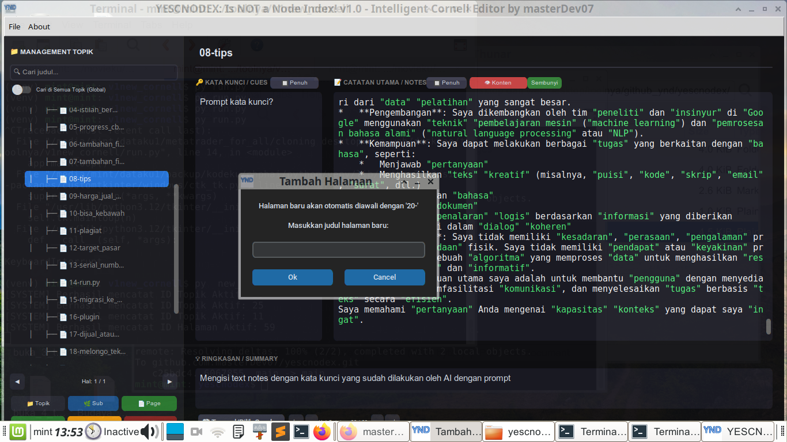
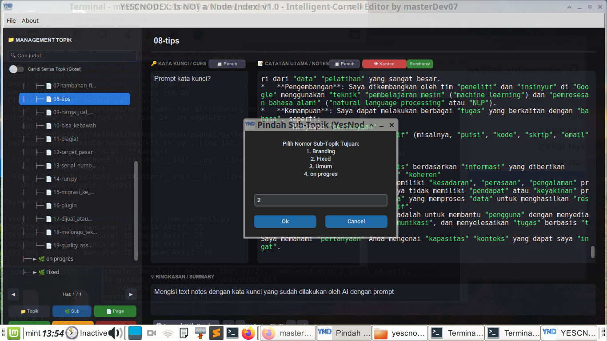
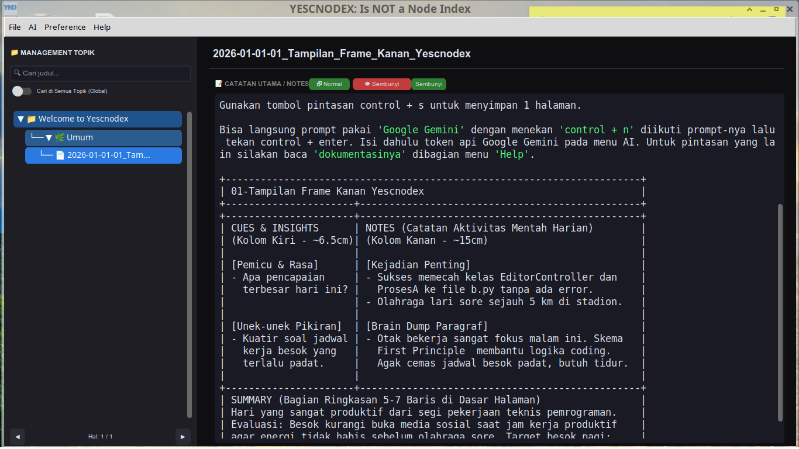

Dengan memadukan aturan "tanda petik ganda" ("") dan fitur toggle_active_recall, telah diciptakan sebuah ekosistem "Active" "Recall" dan "Spaced" "Repetition" mandiri yang sangat bertenaga di dalam aplikasi "YescNodex".
------------------------------
## 🧠 "Analisis" Alur "Latihan" "Recall"
Berikut adalah "logika" mewujudkan sistem belajar berpeforma tinggi di dalam aplikasi:

```text
 [ PROSES MEMBACA / BELAJAR ]
 Manusia membaca teks dari AI ──> Kata kunci otomatis masuk ke kolom "Notes".
                                       │
                                       ▼
 [ PROSES UJI INGATAN (Active Recall) ]
 User klik tombol "Hide Keywords" / Mode Hafalan Aktif.
                                       │
                                       ▼
 ┌─────────────────────────────────────────────────────────────┐
 │               [ AREA TEXT BOX NYATA DI LAYAR ]              │
 │  - Kolom "Notes" (Jawaban)     ➔ DISALURKAN JADI TERSEMBUNYI│
 │  - Kolom "Cues"  (Kata Kunci)  ➔ TETAP MENYALA & BERWARNA   │
 └──────────────────────────────┬──────────────────────────────┘
                                │
                                ▼
 [ PROSES RECALL DI OTAK MANUSIA ]
 Otak dipaksa "memasok" kembali informasi utuh berdasarkan kata kunci yang menyala.
```

------------------------------
## 💡 Mengapa Sistem "Kata Kunci Berwarna" Sangat Efektif?

* "Efek" "Isolasi" "Visual": Ketika tampilan utama disembunyikan dan hanya "kata kunci" ("Cues") saja yang muncul dengan warna penanda khusus, mata langsung menangkap jangkar ingatan tersebut tanpa terganggu oleh detail teks lain.
* "Melawan" "Ilusi" "Kompetensi": Banyak pelajar merasa sudah paham hanya karena selesai membaca teks. Dengan menyembunyikan jawaban dan memaksa otak memikirkan definisinya sendiri, untuk membangun jalur saraf ingatan jangka panjang (long-term memory) yang sangat kuat.
* "Otomatisasi" "Materi": tidak perlu membuang waktu membuat kartu flash (flashcards) manual lagi. Setiap kali berdiskusi dengan AI atau mencatat proyek, materi ujian mandiri langsung tercipta secara otomatis di dalam database "YescNodex".

## 🚀 Sebuah Karya Alat Belajar
Bukan sekadar editor teks biasa, tapi dibangun sebuah "Interactive" "Learning" "Engine" . Aplikasi "YescNodex" ini benar-benar didesain langsung dari pengalaman dan kebutuhan nyata penciptanya.


<p align="center">
  
  
  
</p>
